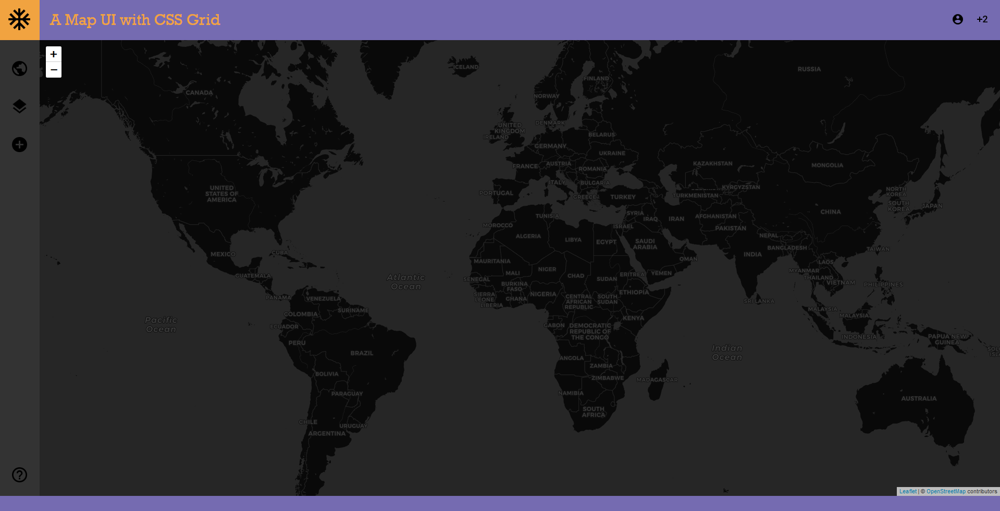

# map-ui

## A Map UI example with flexbox and CSS grid

## Demos:
* [Flexbox](http://pvernier.github.io/demo/map-ui/flexbox.html)
* [CSS grid](http://pvernier.github.io/demo/map-ui/css_grid.html)

It contains a header, a map, a toolbar and a footer.

